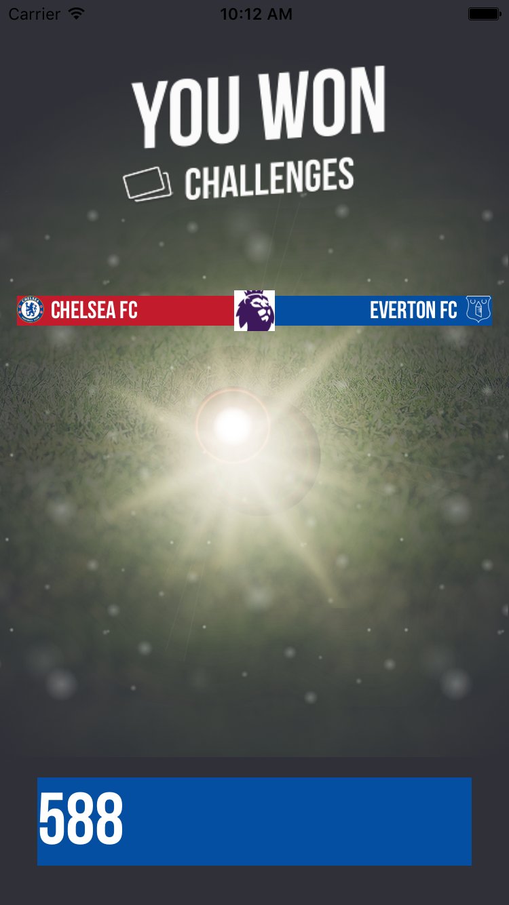

# Notification
An iOS and Android notification screen created with React Native.

## How does it look like?

* Winner screen page

# Getting Started

1. npm install -g react-native-cli
2. git clone https://github.com/5555482/winNotification
3. npm install
4. run `react-native run-android`
5. Enjoy

# Resources Used

* [React Native](https://github.com/facebook/react-native)
* [10 min basics](http://10minbasics.com/react-native-http-get-json/)
* [Stackoverflow](http://stackoverflow.com/questions/29452822/how-to-fetch-data-from-local-json-file-on-react-native)